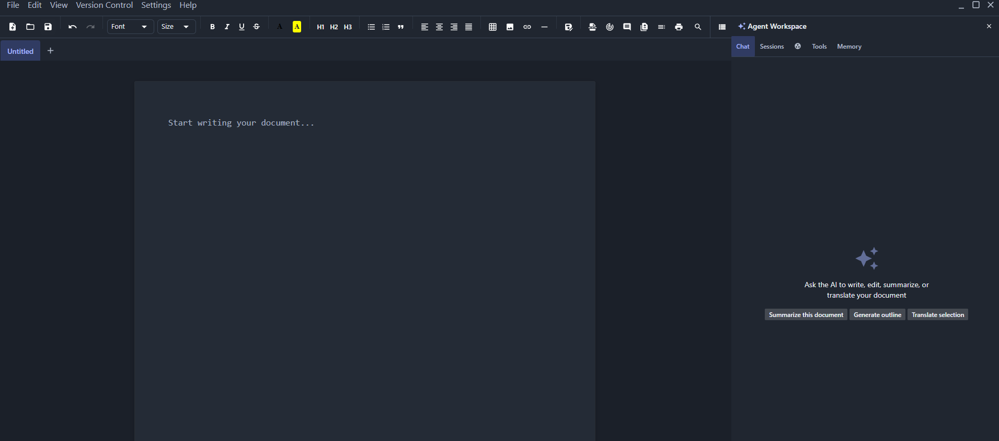

**0.7.0 Will be released by the end of May (5/31), Currently cleaning up the code and adding new features**
# Lexicon — an Agentic Word App

[](https://opensource.org/licenses/MIT)
[](https://github.com/ChristopherSims/agentic-word/releases)
[](https://github.com/ChristopherSims/agentic-word/releases)

A powerful native desktop DOCX editor with AI-driven writing assistance, git-like version control, real-time collaboration, and an extensible plugin ecosystem. Perfect for writers, developers, and knowledge workers who need intelligent document composition with full revision history.

**Lexicon** merges the simplicity of a word processor with the power of AI agents, version control, and collaborative editing—all in a native, fast desktop application.



## Features

- **AI-Powered Writing** — Grammar checking, context-aware suggestions, readability analysis, tone detection, and inline Copilot-style ghost text suggestions (Tab to accept, Escape to dismiss) with auto-dismiss on cursor move
- **Right-Click Context Menu** — Copy, Cut, Paste, Select All, Add Comment, Synonyms (AI), and Translate to any of 23 languages directly from the editor
- **Rich Document Editing** — Full WYSIWYG with TipTap: headings, lists, tables, images, links, footnotes, page breaks, alignment, font family/size/color, background colors
- **Git-like Version Control** — Commits, branches, merge with conflict detection, tags, cherry-pick, interactive rebase (squash/reorder/edit), blame view, stash, patch export/import, DAG graph, VCS hooks
- **Persistent AI Sessions** — Multi-agent support (Writer + Reviewer), web search, outline generation, summarization, 23-language translation, style refinement
- **Rust Native Backend** — Optional Rust (napi-rs) addon for accelerated document processing, PDF export, document analysis, and search
- **Real-Time Collaboration** — Yjs CRDT over WebSocket, shared cursors with colored indicators, room codes, presence awareness, live document sync
- **Document Intelligence** — Inline version diff, table of contents, print preview with headers/footers, comment threads, track changes, autocorrect (typos, smart quotes, em-dash)
- **Plugin Ecosystem** — Sandboxed runtime, 5 lifecycle hooks, per-permission API, built-in marketplace (word frequency, Pomodoro timer, MD paste sanitizer)
- **Export & Import** — DOCX, HTML, Markdown, PDF, EPUB with formatting preservation
- **Dark & Light Themes** — Catppuccin Mocha/Latte, Dracula, Nord, Solarized Dark/Light with custom accent colors
- **Auto-Update** — Built-in update checking with GitHub releases integration


## Installation

### Download Pre-built Installers

Visit the [Releases page](https://github.com/ChristopherSims/agentic-word/releases) to download binary installers:

- **Windows** — NSIS installer or portable EXE (choose your preference)
- **macOS** — DMG disk image or ZIP archive (Intel & Apple Silicon)
- **Linux** — AppImage or DEB package

### Build from Source

**Install dependencies**
```bash
npm install
```
**Development (with hot reload)**
```bash
npm run dev
```
**Production builds**
```bash
npm run build
```
**build rust backend (optional)**
```bash
npm run build:native
```
or
```bash
cd native && npm run build
```
**Create installers (all platforms)**
```bash
npm run dist:all
```

**Platform-specific installers**

Windows
```bash
npm run dist:win
```
macOS
```bash
npm run dist:mac
```
Linux
```bash
npm run dist:linux
```

For detailed build instructions, see [INSTALLER_GUIDE.md](INSTALLER_GUIDE.md).

## Tech Stack

- **Desktop Framework** — Electron with Electron-Vite build system
- **UI Framework** — React 18 with TypeScript
- **State Management** — Zustand for centralized app state
- **Rich Text Editing** — TipTap with custom extensions
- **Styling** — Material-UI (MUI) with Emotion CSS-in-JS
- **Collaboration** — Yjs CRDT + WebSocket
- **Version Control** — Custom git-like VCS engine with DAG support
- **AI Integration** — Multi-agent support with SSE streaming

## Architecture

```
src/
  main/           — Electron main process
    index.ts              Window, menu, IPC handlers, auto-save
    agent-bridge.ts       AI agent with 17 tools, SSE streaming, multi-turn chains
    vcs-engine.ts         Git-like VCS: commits, branches, merge, tags, rebase, stash, blame
    document-store.ts     DOCX/HTML/MD import/export, templates
    plugin-engine.ts      Plugin sandbox, hooks, marketplace
    auto-update.ts        GitHub releases auto-update service
    cloud-storage-service.ts   Cloud sync (v0.5.0+)
    encryption-service.ts      Document encryption (v0.5.1+)
  preload/        — contextBridge API
  renderer/       — React UI
    App.tsx                Root component with ThemeProvider
    components/
      EditorPanel.tsx      Main document editor
      EnhancedEditorPanel  AI-powered suggestions wrapper
      VcsPanel.tsx         Version control interface
      AgentWorkspacePanel  AI agent chat
      SettingsPanel.tsx    User preferences
      Toolbar.tsx          Rich text formatting controls
    store/                 Zustand state (app-store.ts)
    hooks/                 Custom hooks (useAutoUpdate, useAIWriter, etc.)
    context/               React Context providers
    ThemeProvider.tsx      Theme management with 6 themes
    collab-client.ts       Real-time collaboration client
```

## Keyboard Shortcuts

### Editor
| Shortcut | Action |
|----------|--------|
| Ctrl+N | New document |
| Ctrl+O | Open file |
| Ctrl+S | Save |
| Ctrl+Shift+S | Save as |
| Ctrl+F | Find & Replace |
| Ctrl+Enter | Page break |
| Ctrl+B | Bold |
| Ctrl+I | Italic |
| Ctrl+U | Underline |
| Ctrl+T | New tab |
| Ctrl+\\ | Split view |

### AI & Agent
| Shortcut | Action |
|----------|--------|
| Ctrl+Shift+A | Open AI agent workspace |
| Ctrl+Shift+E | AI inline edit |
| Ctrl+Shift+G | Grammar check |
| Ctrl+Shift+R | Readability analysis |
| Tab | Accept AI inline suggestion |
| Escape | Dismiss AI inline suggestion |

### Version Control
| Shortcut | Action |
|----------|--------|
| Ctrl+Shift+V | Open version control panel |
| Ctrl+Shift+C | New commit |
| Ctrl+Shift+B | Branch menu |

### Document
| Shortcut | Action |
|----------|--------|
| Ctrl+, | Settings |
| Ctrl+Shift+M | Add comment |
| Ctrl+Shift+P | Command palette |

## Documentation
- [CHANGELOG.md](CHANGELOG.md) — Version history and release notes
- [INSTALLER_GUIDE.md](INSTALLER_GUIDE.md) — Building and installing from source

## Contributing

Contributions are welcome! Please feel free to submit a Pull Request. For major features, please open an issue first to discuss what you would like to change.

## Support
- 🐛 Bug Reports: [GitHub Issues](https://github.com/ChristopherSims/agentic-word/issues)
- 💬 Discussions: [GitHub Discussions](https://github.com/ChristopherSims/agentic-word/discussions)

## Credits

Built by [Christopher Sims](https://github.com/ChristopherSims) and contributors.

Special thanks to:
- [TipTap](https://tiptap.dev/) for the excellent rich text editor
- [Electron](https://www.electronjs.org/) for the desktop framework
- [Yjs](https://docs.yjs.dev/) for real-time collaboration
- [Material-UI](https://mui.com/) for beautiful components
- [Zustand](https://github.com/pmndrs/zustand) for state management

## License

[MIT](LICENSE) — Copyright (c) 2024-2026, Christopher Sims and Contributors

Lexicon is free and open-source software. You are free to use, modify, and distribute it under the terms of the MIT License.
